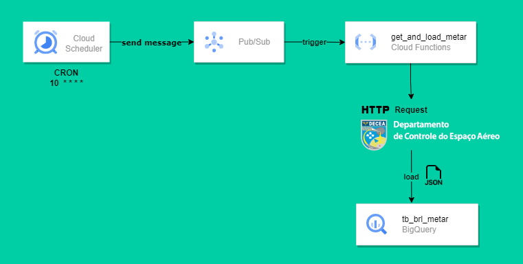
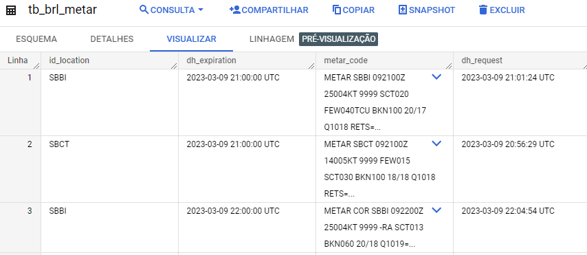

# Aerodrome Meteorological Information API ETL

The METAR code is provided hourly in every non-private aerodrome in the world. This code provides useful information for pilots about the current weather conditions around the aerodrome area.

## Extract and Load Architecture
Given that the data returned by the API is light I have used a simple cloud function to do the JOB. The fuction is triggered hourly by a topic in Pub/Sub that receive messages from Cloud Scheduler. The function sends the request to the API, parse the JSON and load retrived data to a table in Big Query.

**Architecture Diagramam**  



**Final product**  



**Example of METAR code**
```
METAR SBCT 092100Z 14005KT 9999 FEW015 SCT030 BKN100 18/18 Q1018
```

The METAR above provides the following info:
* **Aerodrome code**: SBCT (CURITIBA/Afonso Pena Intenational Airport, BR)
* **METAR's publishing day and UTC time**: 09th at 21:00 UTC 
* **Wind cardinal direction (coming from) and speed**: 140 degrees(SW), 5 knots
*  **Visibility**: 10+ Km
* **Ceilling**: 1500 feet over Aerodrome Ground Level
* **Clouds**: Few clouds at 1500ft, Scatered at 3000ft, Broken at 10000ft
* **Air temperature and Dewpoint**: 18°C / 18°C
* **Aerodrome Pressure**(for setting the altimeter): 1019hPa

## Possible next steps
* Parse METAR code and translate to easily readable information
* Enrich data and create new tables
* Develop an analytical table in order to develop dashboards
